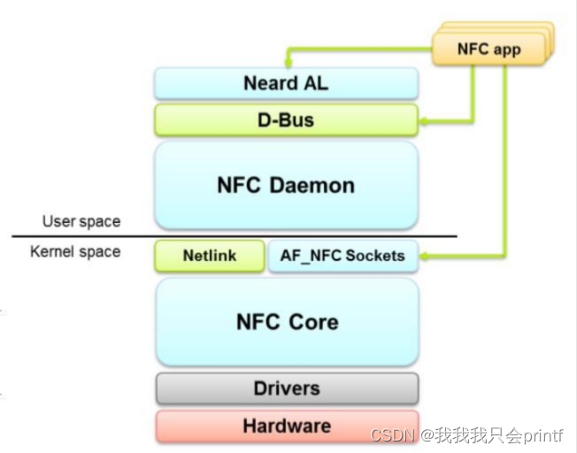

# NFC子系统

## NFC子系统框图

框图如下：

### 硬件接口层
### HCI（Host Controller Interface）
- **定义**：HCI是NFC主机（如智能手机或计算机）与NFC控制器（NFCC）之间的通信接口。它提供了一种标准化的方法，使得主机能够控制NFC控制器并与其进行数据交换。
- **功能**：
  - **命令传输**：主机通过HCI向NFC控制器发送命令，如初始化、寻卡、读写数据等。
  - **事件处理**：NFC控制器通过HCI向主机发送事件，如寻卡成功、数据传输完成等。
  - **数据传输**：主机和NFC控制器之间通过HCI进行数据的传输，支持各种NFC操作模式。
- **实现**：在Linux NFC子系统中，HCI相关的实现主要在`hci`目录下。它定义了HCI的协议规范，并提供了与NFC控制器通信的具体实现。

### NCI（NFC Controller Interface）
- **定义**：NCI是NFC控制器（NFCC）与设备主机（DH）之间的通信接口。它是一种更高级别的接口，专门用于NFC设备的管理和数据交换。
- **功能**：
  - **设备管理**：NCI提供了对NFC控制器的初始化、配置和管理功能，包括设置工作模式、参数调整等。
  - **数据交换**：NCI支持NFC控制器与设备主机之间的数据交换，包括读写操作、寻卡操作等。
  - **事件通知**：NFC控制器通过NCI向设备主机发送各种事件，如设备状态变化、寻卡结果等。
- **实现**：在Linux NFC子系统中，NCI相关的实现主要在`nci`目录下。它定义了NCI的协议规范，并提供了与NFC控制器通信的具体实现。

### 核心驱动框架
- **core.c**：NFC子系统的核心组件，负责将整个NFC协议栈加载到内核中。它提供了统一的接口，整合了底层的HCI/NCI接口和上层的协议栈，使得不同类型的NFC硬件能够通过标准化的方式与系统交互。
- **设备注册与管理**：通过`nfc_allocate_device`函数申请NFC设备，并通过`nfc_register_device`函数注册设备。这些函数确保了NFC设备能够在系统中被正确识别和管理。

### 协议栈层
#### 1. Raw Data Exchange Handler
- **定义**：Raw Data Exchange Handler负责处理原始数据的交换，直接与NFC硬件进行交互，提供最基本的数据读写功能。
- **功能**：
  - **数据传输**：直接与NFC设备进行数据交换，支持读取和写入操作。
  - **命令执行**：执行NFC控制器的原始命令，如寻卡、激活目标、数据交换等。
  - **事件处理**：处理NFC控制器返回的事件，如寻卡成功、数据传输完成等。
- **实现**：在Linux NFC子系统中，Raw Data Exchange Handler的相关实现主要在`rawsock.c`文件中。通过`socket(AF_NFC, SOCK_SEQPACKET, NFC_SOCKPROTO_RAW)`创建socket，应用层可以通过`connect`、`send`和`recv`等函数进行数据传输。

#### 2. LLCP Handler
- **定义**：LLCP（Logical Link Control Protocol）Handler负责处理逻辑链路控制协议，支持多点通信和数据包传输，是NFC点对点通信模式（P2P MOD）的基础。
- **功能**：
  - **连接管理**：管理NFC设备之间的逻辑连接，支持多个连接同时存在。
  - **数据包传输**：处理数据包的封装和解封装，确保数据的可靠传输。
  - **服务发现**：支持服务发现机制，允许设备之间发现和使用彼此提供的服务。
- **实现**：在Linux NFC子系统中，LLCP Handler的相关实现主要在`llcp_core.c`、`llcp_sock.c`和`llcp_commands.c`文件中。通过`socket(AF_NFC, SOCK_SEQPACKET, NFC_SOCKPROTO_LLCP)`创建socket，应用层可以通过`connect`、`send`和`recv`等函数进行数据传输。

#### 3. Netlink Handler
- **定义**：Netlink Handler负责处理Generic netlink接口，用于应用层与驱动层之间的命令和事件交互。
- **功能**：
  - **命令传输**：应用层可以通过Netlink发送命令，如启动寻卡、停止寻卡、激活目标等。
  - **事件通知**：驱动层可以通过Netlink向应用层发送事件，如寻卡成功、设备添加、设备移除等。
  - **状态查询**：应用层可以通过Netlink查询NFC设备的状态，如当前模式、连接状态等。
- **实现**：在Linux NFC子系统中，Netlink Handler的相关实现主要在`netlink.c`文件中。通过`genl_socket`创建Netlink socket，应用层可以通过`genl_send`和`genl_recv`等函数进行命令和事件的传输。

### 应用层接口
- **Generic netlink**：用于应用层与驱动层之间的命令和事件交互。例如，应用层可以通过Generic netlink发送寻卡命令，而驱动层在寻卡成功后，会通过Generic netlink发送寻卡事件给应用层。
- **rawsock**：用于应用层与驱动层之间的数据交互。应用层可以通过rawsock向NFC卡写入数据或从NFC卡读取数据。通过`socket(AF_NFC, SOCK_SEQPACKET, NFC_SOCKPROTO_RAW)`创建socket，并使用`connect`、`send`和`recv`等函数进行通信。  

### 应用层开发

- **dbus**：应用层可以通过dbus获取NFC相关事件，如设备添加、移除等事件。
- **AF_NFC Sockets**：应用层可以通过AF_NFC Sockets与内核交互数据，实现对NFC设备的直接控制和数据传输。
- **Neard AL**：Neard作为应用层的一个守护进程，通过Generic netlink与驱动层交互，提供高级的NFC功能和管理。

整个NFC子系统通过这些层次和接口，实现了从硬件到应用层的完整NFC通信功能，支持多种NFC操作模式，如读写模式（R/W MOD）、卡仿真模式（CE MOD）和点对点模式（P2P MOD）。