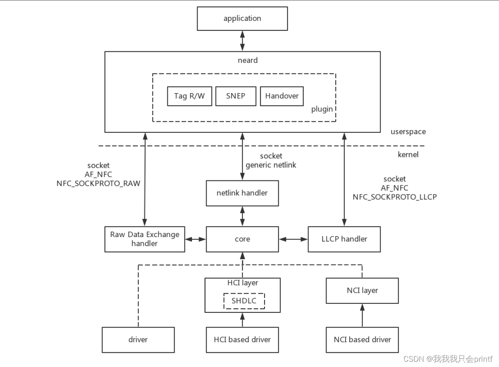

# NFC

这次准备借助Linux的NFC子系统，做一个门禁系统。

**基本功能：**

1. Linux读取NFC卡片信息，与数据库中数据进行匹配。
2. 然后驱动[[Module HMI](https://shop.m5stack.com/products/hmi-module-with-encoder-and-500mah-battery-stm32f030)]亮灯，然后通过滑轮判断是否有人通过。

**进阶功能：**

1. 如果在没有权限的情况下，通过会发出警报。
2. Linux驱动屏幕，显示NFC卡主信息。
3. 并且可以通过触摸修改卡片信息。
4. 接上GPS模块，显示当前地理位置。

## 系统框图

系统运行流程如下：

```mermaid
flowchart LR
    getdata["检测到卡片信息"]
    note["通知闸机允许通过"]
    
    getThrough["闸机通过事件"]
    isLeagle{"判断是否合法通过"}
    
    ileagle["未授权事件，发出警报"]
    leagle["授权事件，重置闸机状态"]
    
    gps["获取GPS信息"]
    show["显示卡片信息"]
    
    getdata --> note
    getdata -.-> show
    gps -.-> show
    
    note -.-> getThrough
    
    getThrough --> isLeagle
    
    
    isLeagle -->|合法| leagle
    isLeagle -->|不合法| ileagle
```

## NFC子系统

linux源码中[NFC](https://so.csdn.net/so/search?q=NFC&spm=1001.2101.3001.7020)在net/nfc下，子系统架构如下：

从最底层看起，硬件驱动有 dirver、HCI layer、NCI layer三种，根据GPT的回答，这三种驱动都需要专业的NFC相关知识。但是越是复杂的子系统驱动，上手速度越快，因为集成度高。

参考文档：

[Linux NFC 子系统 — Linux 内核文档 - Linux 内核](https://docs.linuxkernel.org.cn/networking/nfc.html)

[Linux NFC 子系统剖析_nfc rats-CSDN博客](https://blog.csdn.net/qwe5959798/article/details/135937183)

